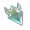

## Окулы и так далее

|                        Изображения                        |                                                                   Навигация                                                                    |    Местонахождение    |
|:---------------------------------------------------------:|:----------------------------------------------------------------------------------------------------------------------------------------------:|:---------------------:|
|             |           [Анемокулы](https://github.com/Sam5440/Genshin_Impact_Teleport/tree/download/ManualCollectPoint/SpecialItems#anemoculuszip)          |        Тейват         |
|         |       [Багровый агат](https://github.com/Sam5440/Genshin_Impact_Teleport/tree/download/ManualCollectPoint/SpecialItems#crimson-agatezip)       |        Тейват         |
|                 |            [Геокулы](https://github.com/Sam5440/Genshin_Impact_Teleport/tree/download/ManualCollectPoint/SpecialItems#geoculuszip)             |        Тейват         |
|         |        [Электрокулы](https://github.com/Sam5440/Genshin_Impact_Teleport/tree/download/ManualCollectPoint/SpecialItems#electroculuszip)         |        Тейват         |
|               |     [Светоносный кристалл](https://github.com/Sam5440/Genshin_Impact_Teleport/tree/download/ManualCollectPoint/SpecialItems#lumensparzip)      | Поземный разлом |
|               | [Светоносная руда](https://github.com/Sam5440/Genshin_Impact_Teleport/tree/download/ManualCollectPoint/SpecialItems#lumenspar-upgradezip)[^1]  |    Поземный разлом    |
|              |           [Знак-ключ](https://github.com/Sam5440/Genshin_Impact_Teleport/tree/download/ManualCollectPoint/SpecialItems#key-sigilzip)           |       Энканомия       |
|           |       [Дендрокулы](https://github.com/Sam5440/Genshin_Impact_Teleport/tree/download/ManualCollectPoint/SpecialItems#dendroculuszip)[^2]        |        Тейват         |
|  |    [Оперенье очищающего света](https://github.com/Sam5440/Genshin_Impact_Teleport/tree/download/ManualCollectPoint/SpecialItems/Dendroculus#34zip)[^3]    |        Тейват         |
|             |     [Скрижали обелисков](https://github.com/Sam5440/Genshin_Impact_Teleport/tree/download/ManualCollectPoint/SpecialItems#sacred-sealzip)      |        Тейват         |

## Local Specialties

| AddTime    | Img                                                    | Name/ID             | World  | Author/ID         | NOTE         |
| ---------- |--------------------------------------------------------| ------------------- | ------ | ----------------- | -------------|
| 2023/01/24  |  | [Sand Grease Pupa](https://github.com/Sam5440/Genshin_Impact_Teleport/tree/download/ManualCollectPoint/LocalSpecialties#sandgreasepupazip) | Teyvat | [Drich#6666](https://github.com/Drich3614) | 74 Pupae |
| 2022/10/07 |                  | [scarab](https://github.com/Sam5440/Genshin_Impact_Teleport/tree/download/ManualCollectPoint/LocalSpecialties#teyvat-scarabzip) | Teyvat | ShinaKaria#9760 | 72 pcs |
| 2022/10/12 |                  | [scarab#2](https://github.com/Sam5440/Genshin_Impact_Teleport/tree/download/ManualCollectPoint/LocalSpecialties#teyvat-scarab2zip) | Teyvat | civicmanan#2171 | 74 pcs |
| 2023/01/26 |          | [Silk Flower](https://github.com/Sam5440/Genshin_Impact_Teleport/tree/download/ManualCollectPoint/LocalSpecialties#silkflowerzip) | Teyvat | [Drich#6666](https://github.com/Drich3614) | 28 Flowers |
| 2023/03/03 |  | [Windwheel Aster](https://github.com/Sam5440/Genshin_Impact_Teleport/tree/download/ManualCollectPoint/LocalSpecialties#windwheelasterzip) | Teyvat | [Amin#0005](https://github.com/AminAbbar) | 73 Flowers |
| 2023/03/10 |                | [Qingxin](https://github.com/Sam5440/Genshin_Impact_Teleport/tree/download/ManualCollectPoint/LocalSpecialties#qingxinzip) | Teyvat | [Amin#0005](https://github.com/AminAbbar) | 158 Flowers |
| 2023/03/10 |                | [Cecilia](https://github.com/Sam5440/Genshin_Impact_Teleport/tree/download/ManualCollectPoint/LocalSpecialties#ceciliazip) | Teyvat | [Amin#0005](https://github.com/AminAbbar) | 37 Flowers |
## Inventory

| AddTime    | Img                                              | Name/ID    | World  | Author/ID       | NOTE |
| ---------- |--------------------------------------------------| ---------- | ------ | --------------- | ---- |
| 2022/10/07 |  | [CrystalCore_12point](https://github.com/Sam5440/Genshin_Impact_Teleport/tree/download/ManualCollectPoint/Inventory#crystalcore_12pointzip) | Teyvat | Linxia#0961              | 12 point     |
| 2022/10/15 |  | [CrystalCore_35point](https://github.com/Sam5440/Genshin_Impact_Teleport/tree/download/ManualCollectPoint/Inventory#crystalcore_35pointzip) | Teyvat | Chongdong#4545 | 2022/10/07's CrystalCore_12point update version. |

## Chunks

| AddTime    | Img                                                                                                      | Name/ID                                                      | World                                     | Author/ID                        | NOTE                                                         |
| ---------- |----------------------------------------------------------------------------------------------------------| ------------------------------------------------------------ | ----------------------------------------- | -------------------------------- | ------------------------------------------------------------ |
| 2022/10/11 |  | [72Enrichment points](https://github.com/Sam5440/Genshin_Impact_Teleport/tree/download/ManualCollectPoint/Chunk#72enrichmentpointszip) | Teyvat(1-38)/The Chasm Underground(38-72) | jdbddbhd#9874                    | 72 mineral enrichment points, including Inazuma,maybe you need to move to pick/destory them.And points after 38 are in The Chasm Underground |
| 2022/10/07 |                                                        | [CrystalChunk](https://github.com/Sam5440/Genshin_Impact_Teleport/tree/download/ManualCollectPoint/Chunk#crystalchunkzip) | Teyvat                                    | Michell Lim#9331 and Linxia#0961 | /                                                            |
| 2022/10/07 |                                                        | [CrystalChunk-The Chasm Underground](https://github.com/Sam5440/Genshin_Impact_Teleport/tree/download/ManualCollectPoint/Chunk#crystalchunk-the-chasm-undergroundzip) | The Chasm Underground                     | Michell Lim#9331 and Linxia#0961 | CrystalChunk-19 to 43 are in The Chasm Underground.          |
| 2022/10/11 |                                                        | [EnkanomiyaAmethystLump](https://github.com/Sam5440/Genshin_Impact_Teleport/tree/download/ManualCollectPoint/Chunk#enkanomiyaamethystlumpzip) | Enkanomiya                                | Michell Lim#9331                 | /                                                            |
| 2022/10/11 |                                                        | [AmethystLump](https://github.com/Sam5440/Genshin_Impact_Teleport/tree/download/ManualCollectPoint/Chunk#amethystlumpzip) | Teyvat                                    | Michell Lim#9331                 | /                                                            |

## Monsters

(Outdated)Points below are only upgraded up to version 2.8.

| AddTime    | Img                                                          | Name/ID          | World  | Author/ID        | NOTE                                                         |
| ---------- | ------------------------------------------------------------ | ---------------- | ------ | ---------------- | ------------------------------------------------------------ |
| 2022/10/11 |  | [Unusual Hilichurl](https://github.com/Sam5440/Genshin_Impact_Teleport/tree/download/ManualCollectPoint/Monster#unusualhilichurlzip) | Teyvat | jdbddbhd#9874    | /                                                            |
| 2022/10/11 |             | [Fatui Agent](https://github.com/Sam5440/Genshin_Impact_Teleport/tree/download/ManualCollectPoint/Monster#fatuiagentzip)       | Teyvat | Michell Lim#9331 | /        |
| 2022/12/22 |             | [Fatui Agent 22](https://github.com/Sam5440/Genshin_Impact_Teleport/tree/download/ManualCollectPoint/Monster#fatuiagent22zip)       | Teyvat | Unknow | /                                                          |
| 2022/10/12 |                       | [Slime](https://github.com/Sam5440/Genshin_Impact_Teleport/tree/download/ManualCollectPoint/Monster#slimezip)            | Teyvat | Foxx#0061        | Sorted by different color/properties.(ver2.8)             |
| 2022/10/12 |                   | [Specter](https://github.com/Sam5440/Genshin_Impact_Teleport/tree/download/ManualCollectPoint/Monster#specterzip)          | Teyvat | Foxx#0061        | Sorted by different color/properties.(ver2.8)             |
| 2022/10/12 |  | [Rifthound](https://github.com/Sam5440/Genshin_Impact_Teleport/tree/download/ManualCollectPoint/Monster#rifthoundzip)        | Teyvat | Foxx#0061        | Sorted by different color/properties.(ver2.8)             |
| 2022/10/12 |  | [Fatui Elite](https://github.com/Sam5440/Genshin_Impact_Teleport/tree/download/ManualCollectPoint/Monster#fatuielitezip)       | Teyvat | Foxx#0061        | Sorted by different kind.(ver2.8)                         |
| 2022/10/12 |   | [Fatui Skirmisher](https://github.com/Sam5440/Genshin_Impact_Teleport/tree/download/ManualCollectPoint/Monster#fatuiskirmisherzip)  | Teyvat | Foxx#0061        | Sorted by different color/properties.(ver2.8)             |
| 2022/10/12 |  | [Nobushi&Kairagi](https://github.com/Sam5440/Genshin_Impact_Teleport/tree/download/ManualCollectPoint/Monster#nobushikairagizip)  | Teyvat | Foxx#0061        | Sorted by different kinds.(ver2.8)                        |
| 2022/10/12 |       | [Whopperflower](https://github.com/Sam5440/Genshin_Impact_Teleport/tree/download/ManualCollectPoint/Monster#whopperflowerzip)    | Teyvat | Foxx#0061        | Sorted by different color/properties,and**you should press "F" to find the WhopperFlower which is hiding  in the flowers**.(ver2.8) |
| 2022/10/12 |   | [Treasure Hoarders](https://github.com/Sam5440/Genshin_Impact_Teleport/tree/download/ManualCollectPoint/Monster#treasurehoarderszip) | Teyvat | Foxx#0061        | Sorted by different kinds.(ver2.8)                        |
| 2022/10/18 |                       | [Fungi](https://github.com/Sam5440/Genshin_Impact_Teleport/tree/download/ManualCollectPoint/Monster#fungizip)            | Teyvat | sam5440 | fungal-spores,11 pcs point                                   |
| 2023/01/27 |  | [ConsecratedBeast](https://github.com/Sam5440/Genshin_Impact_Teleport/tree/download/ManualCollectPoint/Monster#consecratedBeastzip) | Teyvat | Noxbur#8330 | /                                                            |
| 2023/01/28 |  | [Nobushi&Kairagi-2](https://github.com/Sam5440/Genshin_Impact_Teleport/tree/download/ManualCollectPoint/Monster#nobushikairagizip-2) | Teyvat | 6-716#1245 | 6-716#1245 Manually screened efficient points |
| 2023/01/28 |  | [Specter-2](https://github.com/Sam5440/Genshin_Impact_Teleport/tree/download/ManualCollectPoint/Monster#specter-2zip) | Teyvat | 6-716#1245 | 6-716#1245 Manually screened efficient points |
| 2023/01/28 |  | [Black Serpent Knight](https://github.com/Sam5440/Genshin_Impact_Teleport/tree/download/ManualCollectPoint/Monster#blackserpentknightzip) | The Chasm Underground | 6-716#1245 | 6-716#1245 Manually screened efficient points |
| 2023/01/28 | ...... | [Ruin Machines](https://github.com/Sam5440/Genshin_Impact_Teleport/tree/download/ManualCollectPoint/Monster#ruinmachineszip) | Teyvat | 6-716#1245 | 6-716#1245 Manually screened efficient points |

## Chest

| AddTime    | Name                                                         | Floder Name/ID                                               | World  | Author/ID        | NOTE                                                         |
| ---------- | ------------------------------------------------------------ | ------------------------------------------------------------ | ------ | ---------------- | ------------------------------------------------------------ |
| 2022/10/13 | Ver3.1 RockPileSemeru | [Ver3.1 RockPileSemeru](https://github.com/Sam5440/Genshin_Impact_Teleport/tree/download/ManualCollectPoint/Chest#ver31-rockpilesemeruzip) | Teyvat | Michell Lim#9331 | Some of them are inside the sand pile and need to be cleared by wind elements, another one is to break the bottle, and 2 are to break the rock |
| 2022/12/22 | Liyue  - 1043 chest | [Liyue Chests Json 1043](https://github.com/Sam5440/Genshin_Impact_Teleport/tree/download/ManualCollectPoint/Chest#liyue-chests-json-1043zip) | Teyvat | ꧁༺ꜱɑ¡ζɑლɑ༻꧂#1264 | all Liyue chest.num:1043                                     |
| 2023/01/10 | Generate Chest | [Generate Chest](https://github.com/Sam5440/Genshin_Impact_Teleport/tree/download/ManualCollectPoint/Chest#generate-chestzip) | ALL    | lithtech#9980    | Only the treasure chest location JSON exists, no starting point for solving the treasure chest in the puzzle category |
| 2023/01/20 | Ver3.4 Chest | [Ver3.4 Chest](https://github.com/Sam5440/Genshin_Impact_Teleport/tree/download/ManualCollectPoint/Chest#ver34-chestzip) | Teyvat | 空白#0099 | All chest in ver 3.4's new area ,include (RockPileSemeru),but Some need to Decrypt . |

## ExploreTo100

| AddTime | Name | Floder Name/ID | World | Author/ID | NOTE |
| ------------- | ------------------------------------------------------------ | ----------------------------- | ------------ | ----------------- | ------------------------------------------------------------ |
| 2022/11/04    | Sumeru Desert - 100% | [Sumeru_Desert_100](https://github.com/Sam5440/Genshin_Impact_Teleport/tree/download/ManualCollectPoint/ExploreTo100#sumeru_desert_100zip)             | Teyvat       | zxcreepz#0001     | Sumeru Desert - 100% region - all chests, sacred seals and dendroculus |
| 2022/11/04    | Sumeru  - 100% | [Sumeru_Region_100](https://github.com/Sam5440/Genshin_Impact_Teleport/tree/download/ManualCollectPoint/ExploreTo100#sumeru_region_100zip)           | Teyvat       | zxcreepz#0001     | Sumeru  100% region - all chests, sacred seals and dendroculus |
| 2023/01/10    | TheChasm100% | [The Chasm 100%](https://github.com/Sam5440/Genshin_Impact_Teleport/tree/download/ManualCollectPoint/ExploreTo100#thechasm100zip)                | Thechasm100% | serendipity#3437  | The Chasm 100%                                               |
| 2023/01/10    | The Chasm UndergroundMines 100% | [TheChasmUndergroundMines 100%](https://github.com/Sam5440/Genshin_Impact_Teleport/tree/download/ManualCollectPoint/ExploreTo100#thechasmundergroundmines100zip) | The chasm    | serendipity#3437  | The Chasm UndergroundMines 100%                              |

## OtherPoint

Not coordinates. Some of the files needed are pictures etc.

| AddTime    | Name                                                          | Floder Name/ID                   | World  | Author/ID        | NOTE                                                         |
| ---------- | ------------------------------------------------------------ | ------------------------- | ------ | ---------------- | ------------------------------------------------------------ |
| 2022/10/07 | artifact farm-圣遗物狗粮[dogfood] | [gouliangv2](https://github.com/Sam5440/Genshin_Impact_Teleport/tree/download/ManualCollectPoint/OtherPoint#gouliangv2zip)                | Teyvat | 傻逼#7734        | P/S:作者ID确实叫这个，没有骂人的意思             |
| 2022/10/12 | artifact farm-圣遗物狗粮[dogfood] | [AutoArtifact](https://github.com/Sam5440/Genshin_Impact_Teleport/tree/download/ManualCollectPoint/OtherPoint#autoartifactzip)              | Teyvat | ShinaKaria#9760  | AB路线破圣遗物调查点上限(A127+B123), ,A68~70为森林书后开放点位  须弥左上角那个,一共4个调查点 |
| 2022/10/11 | 兰那罗            | [76Aranara](https://github.com/Sam5440/Genshin_Impact_Teleport/tree/download/ManualCollectPoint/OtherPoint#76aranarazip)                 | Teyvat | Flowers#0948    | 76个兰那罗，这个不能全自动的奥，需要交材料 弹琴之类的，需要材料如下 |
| 2023/01/20 | 3.4Limited Time Challenge | [3.4Limited Time Challenge](https://github.com/Sam5440/Genshin_Impact_Teleport/tree/download/ManualCollectPoint/OtherPoint#34limited-time-challengezip) | Teyvat | 空白#0099 | Version 3.4 new area Limited Time Challenge point. |
| 3.4LuminousSeelie | 3.4LuminousSeelie | [3.4LuminousSeelie](https://github.com/Sam5440/Genshin_Impact_Teleport/tree/download/ManualCollectPoint/OtherPoint#34luminousseeliezip) | Teyvat | 空白#0099 | Version 3.4 new area LuminousSeelie point. |
| Fishing Points | Fishing Points | [Fishing Points](https://github.com/Sam5440/Genshin_Impact_Teleport/tree/download/ManualCollectPoint/OtherPoint#fishpondzip) | Teyvat | [COOL#6860](https://github.com/limitcool) | Fish ponds. |
