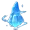

  
 
  
   
  

   
  

 </img>
  

  Если вам это помогло то пожалуйста поставьте <b>звезду</b> на репозиторий!

---

> **Для того чтобы установить файлы которые вам нужны вам достаточно нажать на кнопки ниже. Вы автоматически перейдете к тем файлам**

## Окулы и так далее

|                        Изображения                        |                                                                      Навигация                                                                      | Местонахождение |
|-----------------------------------------------------------|:---------------------------------------------------------------------------------------------------------------------------------------------------:|:---------------:|
|             |                 [Анемокулы](https://github.com/AluminiumTN/Sorted-TP-Files-RU/tree/Sorted-TP-Files-RU/Окулы%20и%20т.д#анемокулыzip)                 |     Тейват      |
|         |            [Багровый агат](https://github.com/AluminiumTN/Sorted-TP-Files-RU/tree/Sorted-TP-Files-RU/Окулы%20и%20т.д#багровые-агатыzip)             |     Тейват      |
|                 |                   [Геокулы](https://github.com/AluminiumTN/Sorted-TP-Files-RU/tree/Sorted-TP-Files-RU/Окулы%20и%20т.д#геокулыzip)                   |     Тейват      |
|         |               [Электрокулы](https://github.com/AluminiumTN/Sorted-TP-Files-RU/tree/Sorted-TP-Files-RU/Окулы%20и%20т.д#электрокулыzip)               |     Тейват      |
|               |      [Светоносный кристалл](https://github.com/AluminiumTN/Sorted-TP-Files-RU/tree/Sorted-TP-Files-RU/Окулы%20и%20т.д#светоносный-кристаллzip)      | Поземный разлом |
|               |          [Светоносная руда](https://github.com/AluminiumTN/Sorted-TP-Files-RU/tree/Sorted-TP-Files-RU/Окулы%20и%20т.д#светоносная-рудаzip)          | Поземный разлом |
|              |                 [Знак-ключ](https://github.com/AluminiumTN/Sorted-TP-Files-RU/tree/Sorted-TP-Files-RU/Окулы%20и%20т.д#знак-ключzip)                 |    Энканомия    |
|           |                [Дендрокулы](https://github.com/AluminiumTN/Sorted-TP-Files-RU/tree/Sorted-TP-Files-RU/Окулы%20и%20т.д#дендрокулыzip)                |     Тейват      |
|             |                 [Гидрокулы](https://github.com/AluminiumTN/Sorted-TP-Files-RU/tree/Sorted-TP-Files-RU/Окулы%20и%20т.д#гидрокулыzip)                 |     Тейват      |
|  | [Оперенье очищающего света](https://github.com/AluminiumTN/Sorted-TP-Files-RU/tree/Sorted-TP-Files-RU/Окулы%20и%20т.д#оперенье-очищающего-светаzip) |     Тейват      |
|             |        [Скрижали обелисков](https://github.com/AluminiumTN/Sorted-TP-Files-RU/tree/Sorted-TP-Files-RU/Окулы%20и%20т.д#скрижали-обелисковzip)        |     Тейват      |

