

  
 
  
   
  

   
  

 </img>
  

  Если вам это помогло то пожалуйста поставьте <b>звезду</b> на репозиторий

---

> **Для того чтобы установить файлы которые вам нужны вам достаточно нажать на кнопки ниже. У вас автоматически начнётся скачка файлов**
---
> Если вы не нашли то что вам нужно, либо заметили какие либо ошибки пожжалуйста напишите мне в [дискорде](https://discordapp.com/users/433946205983342593/)

## Навигация
__[1. Окулы](https://github.com/AluminiumTN/Sorted-TP-Files-RU#окулы-и-так-далее)__

__[2. Монстры](https://github.com/AluminiumTN/Sorted-TP-Files-RU#монстры)__

__[3. Минералы](https://github.com/AluminiumTN/Sorted-TP-Files-RU#минералы)__

__[4. Животные](https://github.com/AluminiumTN/Sorted-TP-Files-RU#животные)__

__[5. Растения](https://github.com/AluminiumTN/Sorted-TP-Files-RU#растения)__

---
## Окулы и так далее

|                        Изображения                        |                                                                             Навигация                                                                              | Местонахождение  |
|:---------------------------------------------------------:|:------------------------------------------------------------------------------------------------------------------------------------------------------------------:|:----------------:|
|             |                   [Анемокулы](https://raw.githubusercontent.com/AluminiumTN/Sorted-TP-Files-RU/Sorted-TP-Files-RU/Окулы%20и%20т.д/Анемокулы.zip)                   |      Тейват      |
|         |              [Багровый агат](https://raw.githubusercontent.com/AluminiumTN/Sorted-TP-Files-RU/Sorted-TP-Files-RU/Окулы%20и%20т.д/Багровый%20агат.zip)              |      Тейват      |
|                 |                     [Геокулы](https://raw.githubusercontent.com/AluminiumTN/Sorted-TP-Files-RU/Sorted-TP-Files-RU/Окулы%20и%20т.д/Геокулы.zip)                     |      Тейват      |
|         |                 [Электрокулы](https://raw.githubusercontent.com/AluminiumTN/Sorted-TP-Files-RU/Sorted-TP-Files-RU/Окулы%20и%20т.д/Электрокулы.zip)                 |      Тейват      |
|               |       [Светоносный кристалл](https://raw.githubusercontent.com/AluminiumTN/Sorted-TP-Files-RU/Sorted-TP-Files-RU/Окулы%20и%20т.д/Светоносный%20кристалл.zip)       | Подземный разлом |
|               |           [Светоносная руда](https://raw.githubusercontent.com/AluminiumTN/Sorted-TP-Files-RU/Sorted-TP-Files-RU/Окулы%20и%20т.д/Светоносная%20руда.zip)           | Подземный разлом |
|              |                   [Знак-ключ](https://raw.githubusercontent.com/AluminiumTN/Sorted-TP-Files-RU/Sorted-TP-Files-RU/Окулы%20и%20т.д/Знак-ключ.zip)                   |    Энканомия     |
|           |                     [Дендрокулы](https://raw.githubusercontent.com/AluminiumTN/Sorted-TP-Files-RU/Sorted-TP-Files-RU/Окулы%20и%20т.д/Дендрокулы.zip)               |      Тейват      |
|             |                   [Гидрокулы](https://raw.githubusercontent.com/AluminiumTN/Sorted-TP-Files-RU/Sorted-TP-Files-RU/Окулы%20и%20т.д/Гидрокулы.zip)                   |      Тейват      |
|  | [Оперенье очищающего света](https://raw.githubusercontent.com/AluminiumTN/Sorted-TP-Files-RU/Sorted-TP-Files-RU/Окулы%20и%20т.д/Оперенье%20очищающего%20света.zip) |      Тейват      |
|             |         [Скрижали обелисков](https://raw.githubusercontent.com/AluminiumTN/Sorted-TP-Files-RU/Sorted-TP-Files-RU/Окулы%20и%20т.д/Скрижали%20обелисков.zip)         |      Тейват      |

## Монстры

|                                 Изображения                                 |                                                                       Навигация                                                                        | Местонахождение |
|:---------------------------------------------------------------------------:|:------------------------------------------------------------------------------------------------------------------------------------------------------:|:---------------:|
|                               |             [Агенты фатуи](https://raw.githubusercontent.com/AluminiumTN/Sorted-TP-Files-RU/Sorted-TP-Files-RU/Монстры/Агент%20фатуи.zip)              |     Тейват      |
|                  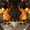                   |                     [Вишап](https://raw.githubusercontent.com/AluminiumTN/Sorted-TP-Files-RU/Sorted-TP-Files-RU/Монстры/Вишап.zip)                     |     Тейват      |
|                             |             [Волк разрыва](https://raw.githubusercontent.com/AluminiumTN/Sorted-TP-Files-RU/Sorted-TP-Files-RU/Монстры/Волк%20Разрыва.zip)             |     Тейват      |
|                         |            [Гидро фантазм](https://raw.githubusercontent.com/AluminiumTN/Sorted-TP-Files-RU/Sorted-TP-Files-RU/Монстры/Гидро%20фантазм.zip)            |     Тейват      |
|                                 |              [Дракон руин](https://raw.githubusercontent.com/AluminiumTN/Sorted-TP-Files-RU/Sorted-TP-Files-RU/Монстры/Дракон%20руин.zip)              |     Тейват      |
|                     |        [Застрельщик фатуи](https://raw.githubusercontent.com/AluminiumTN/Sorted-TP-Files-RU/Sorted-TP-Files-RU/Монстры/Застрельщик%20Фатуи.zip)        |     Тейват      |
|                           |   [Зеркальная дева фатуи](https://raw.githubusercontent.com/AluminiumTN/Sorted-TP-Files-RU/Sorted-TP-Files-RU/Монстры/Зеркальная%20дева%20Фатуи.zip)   |     Тейват      |
|                     |          [Инород Фонтерма](https://raw.githubusercontent.com/AluminiumTN/Sorted-TP-Files-RU/Sorted-TP-Files-RU/Монстры/Инород%20Фонтмера.zip)          |     Тейват      |
|                                     |                   [Кайраги](https://raw.githubusercontent.com/AluminiumTN/Sorted-TP-Files-RU/Sorted-TP-Files-RU/Монстры/Кайраги.zip)                   |     Тейват      |
|                        |                  [Лавачурл](https://raw.githubusercontent.com/AluminiumTN/Sorted-TP-Files-RU/Sorted-TP-Files-RU/Монстры/Лавачурл.zip)                  |     Тейват      |
|                                 |               [Маг бездны](https://raw.githubusercontent.com/AluminiumTN/Sorted-TP-Files-RU/Sorted-TP-Files-RU/Монстры/Маг%20бездны.zip)               |     Тейват      |
|           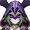            |                [Маг цицин](https://raw.githubusercontent.com/AluminiumTN/Sorted-TP-Files-RU/Sorted-TP-Files-RU/Монстры/Маг%20цицин.zip)                |     Тейват      |
|                                             |                       [Мек](https://raw.githubusercontent.com/AluminiumTN/Sorted-TP-Files-RU/Sorted-TP-Files-RU/Монстры/Мек.zip)                       |     Тейват      |
|                                 |                  [Метачурл](https://raw.githubusercontent.com/AluminiumTN/Sorted-TP-Files-RU/Sorted-TP-Files-RU/Монстры/Метачурл.zip)                  |     Тейват      |
|                   |       [Странный хиличурл](https://raw.githubusercontent.com/AluminiumTN/Sorted-TP-Files-RU/Sorted-TP-Files-RU/Монстры/Необычный%20хиличурл.zip)        |     Тейват      |
|                                     |                    [Ноубси](https://raw.githubusercontent.com/AluminiumTN/Sorted-TP-Files-RU/Sorted-TP-Files-RU/Монстры/Нобуси.zip)                    |     Тейват      |
|                                 |                   [Отимуся](https://raw.githubusercontent.com/AluminiumTN/Sorted-TP-Files-RU/Sorted-TP-Files-RU/Монстры/Отимуся.zip)                   |     Тейват      |
|                     | [Первозданная конструкция](https://raw.githubusercontent.com/AluminiumTN/Sorted-TP-Files-RU/Sorted-TP-Files-RU/Монстры/Первозданная%20конструкция.zip) |     Тейват      |
|                                         |                 [Плесенник](https://raw.githubusercontent.com/AluminiumTN/Sorted-TP-Files-RU/Sorted-TP-Files-RU/Монстры/Плесенник.zip)                 |     Тейват      |
|                         |                [Попрыгунья](https://raw.githubusercontent.com/AluminiumTN/Sorted-TP-Files-RU/Sorted-TP-Files-RU/Монстры/Попрыгунья.zip)                |      Тейват     |
|          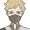          |      [Похитители сокровищ](https://raw.githubusercontent.com/AluminiumTN/Sorted-TP-Files-RU/Sorted-TP-Files-RU/Монстры/Похитители%20сокровищ.zip)      |     Тейват      |
|                                     |                   [Призрак](https://raw.githubusercontent.com/AluminiumTN/Sorted-TP-Files-RU/Sorted-TP-Files-RU/Монстры/Призрак.zip)                   |     Тейват      |
|                             |        [Протоген расщелин](https://raw.githubusercontent.com/AluminiumTN/Sorted-TP-Files-RU/Sorted-TP-Files-RU/Монстры/Протоген%20расщелин.zip)        |     Тейват      |
|                             |                [Пустынники](https://raw.githubusercontent.com/AluminiumTN/Sorted-TP-Files-RU/Sorted-TP-Files-RU/Монстры/Пустынники.zip)                |     Тейват      |
|                               |           [Руинный молотильщик](https://github.com/AluminiumTN/Sorted-TP-Files-RU/blob/Sorted-TP-Files-RU/Монстры/Руинный%20молотильщик.zip)           |     Тейват      |
| 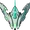 |         [Священный хищник](https://raw.githubusercontent.com/AluminiumTN/Sorted-TP-Files-RU/Sorted-TP-Files-RU/Монстры/Священный%20хищник.zip)         |     Тейват      |
|                    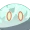                     |                    [Слаймы](https://raw.githubusercontent.com/AluminiumTN/Sorted-TP-Files-RU/Sorted-TP-Files-RU/Монстры/Слаймы.zip)                    |     Тейват      |
|                                 |               [Страж руин](https://raw.githubusercontent.com/AluminiumTN/Sorted-TP-Files-RU/Sorted-TP-Files-RU/Монстры/Страж%20руин.zip)               |     Тейват      |
|         |           [Хиличурл изгой](https://raw.githubusercontent.com/AluminiumTN/Sorted-TP-Files-RU/Sorted-TP-Files-RU/Монстры/Хиличурл%20изгой.zip)           |     Тейват      |
|                   |            [Хиличурл стрелок](https://raw.githubusercontent.com/AluminiumTN/Sorted-TP-Files-RU/Sorted-TP-Files-RU/Монстры/Хиличурл%20стрелок.zip)      |     Тейват      |
|                                 |                 [Хиличурлы](https://raw.githubusercontent.com/AluminiumTN/Sorted-TP-Files-RU/Sorted-TP-Files-RU/Монстры/Хиличурлы.zip)                 |     Тейват      |
|             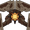              |             [Часовые руин](https://raw.githubusercontent.com/AluminiumTN/Sorted-TP-Files-RU/Sorted-TP-Files-RU/Монстры/Часовые%20руин.zip)             |     Тейват      |
|                             |              [Чёрные змеи](https://raw.githubusercontent.com/AluminiumTN/Sorted-TP-Files-RU/Sorted-TP-Files-RU/Монстры/Чёрные%20Змеи.zip)              |     Тейват      |
|                                 |                  [Шамачурл](https://raw.githubusercontent.com/AluminiumTN/Sorted-TP-Files-RU/Sorted-TP-Files-RU/Монстры/Шамачурл.zip)                  |     Тейват      |

## Минералы

|                                   Изображения                                   |                                                                             Навигация                                                                              | Местонахождение |
|:-------------------------------------------------------------------------------:|:------------------------------------------------------------------------------------------------------------------------------------------------------------------:|:---------------:|
|                             |              [Архаичный камень](https://raw.githubusercontent.com/AluminiumTN/Sorted-TP-Files-RU/Sorted-TP-Files-RU/Минералы/Архаичный%20камень.zip)               |     Тейват      |
|                                   |     [Руда звёздного серебра](https://raw.githubusercontent.com/AluminiumTN/Sorted-TP-Files-RU/Sorted-TP-Files-RU/Минералы/Заснеженное%20зведное%20серебро.zip)     |     Тейват      |
|                 |      [Конденсирующиеся кристаллы](https://raw.githubusercontent.com/AluminiumTN/Sorted-TP-Files-RU/Sorted-TP-Files-RU/Минералы/Конденсирующиеся%20кристаллы.zip)   |     Тейват      |
|                   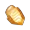                    |                     [Кор ляпис](https://raw.githubusercontent.com/AluminiumTN/Sorted-TP-Files-RU/Sorted-TP-Files-RU/Минералы/Кор%20ляпис.zip)                      |     Тейват      |
|                               |                [Кусок аметиста](https://raw.githubusercontent.com/AluminiumTN/Sorted-TP-Files-RU/Sorted-TP-Files-RU/Минералы/Кусок%20аметиста.zip)                 |     Тейват      |
|                 | [Магический обломок кристалла](https://raw.githubusercontent.com/AluminiumTN/Sorted-TP-Files-RU/Sorted-TP-Files-RU/Минералы/Магический%20обломок%20кристалла.zip)  |     Тейват      |
|                           |        [Обломок белого железа](https://raw.githubusercontent.com/AluminiumTN/Sorted-TP-Files-RU/Sorted-TP-Files-RU/Минералы/Обломок%20белого%20железа.zip)         |     Тейват      |
|                                     |                [Обломок железа](https://raw.githubusercontent.com/AluminiumTN/Sorted-TP-Files-RU/Sorted-TP-Files-RU/Минералы/Обломок%20железа.zip)                 |     Тейват      |
|                               |             [Обломок кристалла](https://raw.githubusercontent.com/AluminiumTN/Sorted-TP-Files-RU/Sorted-TP-Files-RU/Минералы/Обломок%20кристалла.zip)              |        Тейват   |
|                         |             [Полуночный нефрит](https://raw.githubusercontent.com/AluminiumTN/Sorted-TP-Files-RU/Sorted-TP-Files-RU/Минералы/Полуночный%20нефрит.zip)              |     Тейват      |
|               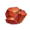                |                      [Тришиарит](https://raw.githubusercontent.com/AluminiumTN/Sorted-TP-Files-RU/Sorted-TP-Files-RU/Минералы/Тришиарит.zip)                       |     Тейват      |
|                           |               [Электро кристалл](https://raw.githubusercontent.com/AluminiumTN/Sorted-TP-Files-RU/Sorted-TP-Files-RU/Минералы/Электро%20кристал.zip)               |     Тейват      |

## Животные

|                        Изображения                         |                                                                           Навигация                                                                           | Местонахождение |
|:----------------------------------------------------------:|:-------------------------------------------------------------------------------------------------------------------------------------------------------------:|:---------------:|
|       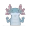       |                       [Вьюнок](https://raw.githubusercontent.com/AluminiumTN/Sorted-TP-Files-RU/Sorted-TP-Files-RU/Животные/Вьюнок.zip)                       |     Тейват      |
|             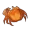             |                         [Краб](https://raw.githubusercontent.com/AluminiumTN/Sorted-TP-Files-RU/Sorted-TP-Files-RU/Животные/Краб.zip)                         |     Тейват      |
|      | [Личинка песчаного жировика](https://raw.githubusercontent.com/AluminiumTN/Sorted-TP-Files-RU/Sorted-TP-Files-RU/Животные/Личинка%20песчаного%20жировика.zip) |     Тейват      |
|             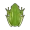             |                      [Лягушка](https://raw.githubusercontent.com/AluminiumTN/Sorted-TP-Files-RU/Sorted-TP-Files-RU/Животные/Лягушка.zip)                      |     Тейват      |
|                    |                         [Мясо](https://raw.githubusercontent.com/AluminiumTN/Sorted-TP-Files-RU/Sorted-TP-Files-RU/Животные/Мясо.zip)                         |     Тейват      |
|             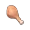             |                  [Мясо птицы](https://raw.githubusercontent.com/AluminiumTN/Sorted-TP-Files-RU/Sorted-TP-Files-RU/Животные/Мясо%20птицы.zip)                  |     Тейват      |
|                          |                         [Рыба](https://raw.githubusercontent.com/AluminiumTN/Sorted-TP-Files-RU/Sorted-TP-Files-RU/Животные/Рыба.zip)                         |     Тейват      |
|          |             [Светлячок удачи](https://raw.githubusercontent.com/AluminiumTN/Sorted-TP-Files-RU/Sorted-TP-Files-RU/Животные/Светлячок%20удачи.zip)             |     Тейват      |
|           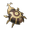           |                     [Скарабей](https://raw.githubusercontent.com/AluminiumTN/Sorted-TP-Files-RU/Sorted-TP-Files-RU/Животные/Скарабей.zip)                     |     Тейват      |
|         |       [Угорь зыбучих песков](https://raw.githubusercontent.com/AluminiumTN/Sorted-TP-Files-RU/Sorted-TP-Files-RU/Животные/Угорь%20зыбучих%20песков.zip)       |     Тейват      |
|  |                   [Хорек вор](https://raw.githubusercontent.com/AluminiumTN/Sorted-TP-Files-RU/Sorted-TP-Files-RU/Животные/Хорек%20вор.zip)                   |     Тейват      |
|            |       [Цельномороженное мясо](https://raw.githubusercontent.com/AluminiumTN/Sorted-TP-Files-RU/Sorted-TP-Files-RU/Животные/Цельномороженное%20мясо.zip)       |     Тейват      |
|       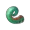       |                        [Хвост ящерицы](https://github.com/AluminiumTN/Sorted-TP-Files-RU/blob/Sorted-TP-Files-RU/Животные/Ящерица.zip)                        |     Тейват      |
|              |                          [Оникабуто](https://raw.githubusercontent.com/AluminiumTN/Sorted-TP-Files-RU/Sorted-TP-Files-RU/Животные/Оникабуто.zip)                          |     Тейват      |

## Растения

|                             Изображения                             |                                                                    Навигация                                                                     | Местонахождение |
|:-------------------------------------------------------------------:|:------------------------------------------------------------------------------------------------------------------------------------------------:|:---------------:|
|                   |    [Аметистовая лампа](https://raw.githubusercontent.com/AluminiumTN/Sorted-TP-Files-RU/Sorted-TP-Files-RU/Растения/Аметистовая%20лампа.zip)     |     Тейват      |
|                           |               [Валяшка](https://raw.githubusercontent.com/AluminiumTN/Sorted-TP-Files-RU/Sorted-TP-Files-RU/Растения/Валяшка.zip)                |     Тейват      |
|       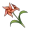        |      [Ветрянная астра](https://raw.githubusercontent.com/AluminiumTN/Sorted-TP-Files-RU/Sorted-TP-Files-RU/Растения/Ветрянная%20астра.zip)       |     Тейват      |
|                           |          [Волчий крюк](https://raw.githubusercontent.com/AluminiumTN/Sorted-TP-Files-RU/Sorted-TP-Files-RU/Растения/Волчий%20крюк.zip)           |     Тейват      |
|                         |      [Глазурная лилия](https://raw.githubusercontent.com/AluminiumTN/Sorted-TP-Files-RU/Sorted-TP-Files-RU/Растения/Глазурная%20лилия.zip)       |     Тейват      |
|     |       [Пылающий цветок](https://raw.githubusercontent.com/AluminiumTN/Sorted-TP-Files-RU/Sorted-TP-Files-RU/Растения/Горящий%20цветок.zip)       |     Тейват      |
|         |        [Гриб филанемо](https://raw.githubusercontent.com/AluminiumTN/Sorted-TP-Files-RU/Sorted-TP-Files-RU/Растения/Гриб%20филанемо.zip)         |     Тейват      |
|                       |           [Гриб звезда](https://raw.githubusercontent.com/AluminiumTN/Sorted-TP-Files-RU/Sorted-TP-Files-RU/Растения/Гриб-звезда.zip)            |     Тейват      |
|                           |                 [Грибы](https://raw.githubusercontent.com/AluminiumTN/Sorted-TP-Files-RU/Sorted-TP-Files-RU/Растения/Грибы.zip)                  |     Тейват      |
| 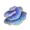 |      [Грибы рукхашава](https://raw.githubusercontent.com/AluminiumTN/Sorted-TP-Files-RU/Sorted-TP-Files-RU/Растения/Грибы%20руккхашава.zip)      |     Тейват      |
|                      |            [Дендробиум](https://raw.githubusercontent.com/AluminiumTN/Sorted-TP-Files-RU/Sorted-TP-Files-RU/Растения/Дендробиум.zip)             |     Тейват      |
|           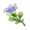           |            [Дожделотос](https://raw.githubusercontent.com/AluminiumTN/Sorted-TP-Files-RU/Sorted-TP-Files-RU/Растения/Дожделотос.zip)             |     Тейват      |
|                         |              [Закатник](https://raw.githubusercontent.com/AluminiumTN/Sorted-TP-Files-RU/Sorted-TP-Files-RU/Растения/Закатник.zip)               |     Тейват      |
|                     |     [Заоблачнй перчик](https://raw.githubusercontent.com/AluminiumTN/Sorted-TP-Files-RU/Sorted-TP-Files-RU/Растения/Заоблачный%20перчик.zip)     |     Тейват      |
|                         |        [Конский хвост](https://raw.githubusercontent.com/AluminiumTN/Sorted-TP-Files-RU/Sorted-TP-Files-RU/Растения/Конский%20хвост.zip)         |     Тейват      |
|                       |       [Красноплодник](https://raw.githubusercontent.com/AluminiumTN/Sorted-TP-Files-RU/Sorted-TP-Files-RU/Растения/Красный%20гребень.zip)        |     Тейват      |
|                | [Ламповый колокольчик](https://raw.githubusercontent.com/AluminiumTN/Sorted-TP-Files-RU/Sorted-TP-Files-RU/Растения/Ламповый%20колокольчик.zip)  |     Тейват      |
|                         |           [Лилия кала](https://raw.githubusercontent.com/AluminiumTN/Sorted-TP-Files-RU/Sorted-TP-Files-RU/Растения/Лилия%20кала.zip)            |     Тейват      |
|               |     [Лотос кальпалата](https://raw.githubusercontent.com/AluminiumTN/Sorted-TP-Files-RU/Sorted-TP-Files-RU/Растения/Лотос%20кальпалата.zip)      |     Тейват      |
|               |      [Лотос нилотпала](https://raw.githubusercontent.com/AluminiumTN/Sorted-TP-Files-RU/Sorted-TP-Files-RU/Растения/Лотос%20нилотпала.zip)       |     Тейват      |
|                       |          [Львиный зев](https://raw.githubusercontent.com/AluminiumTN/Sorted-TP-Files-RU/Sorted-TP-Files-RU/Растения/Львиный%20зев.zip)           |     Тейват      |
|                               |              [Марковка](https://raw.githubusercontent.com/AluminiumTN/Sorted-TP-Files-RU/Sorted-TP-Files-RU/Растения/Марковка.zip)               |     Тейват      |
|                          |                [Маркот](https://raw.githubusercontent.com/AluminiumTN/Sorted-TP-Files-RU/Sorted-TP-Files-RU/Растения/Маркот.zip)                 |     Тейват      |
|                         |              [Мацутакэ](https://raw.githubusercontent.com/AluminiumTN/Sorted-TP-Files-RU/Sorted-TP-Files-RU/Растения/Мацутакэ.zip)               |     Тейват      |
|                           |        [Морская трава](https://raw.githubusercontent.com/AluminiumTN/Sorted-TP-Files-RU/Sorted-TP-Files-RU/Растения/Морская%20трава.zip)         |     Тейват      |
|                   |         [Морской гриб](https://raw.githubusercontent.com/AluminiumTN/Sorted-TP-Files-RU/Sorted-TP-Files-RU/Растения/Морской%20гриб.zip)          |     Тейват      |
|                                   |                  [Мята](https://raw.githubusercontent.com/AluminiumTN/Sorted-TP-Files-RU/Sorted-TP-Files-RU/Растения/Мята.zip)                   |     Тейват      |
|         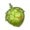         |      [Орехи аджиленах](https://raw.githubusercontent.com/AluminiumTN/Sorted-TP-Files-RU/Sorted-TP-Files-RU/Растения/Орехи%20аджиленах.zip)       |     Тейват      |
|                         |              [Падисара](https://raw.githubusercontent.com/AluminiumTN/Sorted-TP-Files-RU/Sorted-TP-Files-RU/Растения/Падисара.zip)               |     Тейват      |
|                     |        [Персик зайтун](https://raw.githubusercontent.com/AluminiumTN/Sorted-TP-Files-RU/Sorted-TP-Files-RU/Растения/Персик%20зайтун.zip)         |     Тейват      |
|                   | [Плод облачной травы](https://raw.githubusercontent.com/AluminiumTN/Sorted-TP-Files-RU/Sorted-TP-Files-RU/Растения/Плод%20облачной%20травы.zip)  |     Тейват      |
|                 |       [Побеги бамбука](https://raw.githubusercontent.com/AluminiumTN/Sorted-TP-Files-RU/Sorted-TP-Files-RU/Растения/Побеги%20бамбука.zip)        |     Тейват      |
|                      |               [Пузырин](https://raw.githubusercontent.com/AluminiumTN/Sorted-TP-Files-RU/Sorted-TP-Files-RU/Растения/Пузырин.zip)                |     Тейват      |
|                    |        [Радужная роза](https://raw.githubusercontent.com/AluminiumTN/Sorted-TP-Files-RU/Sorted-TP-Files-RU/Растения/Радужная%20роза.zip)         |     Тейват      |
|                               |               [Редиска](https://raw.githubusercontent.com/AluminiumTN/Sorted-TP-Files-RU/Sorted-TP-Files-RU/Растения/Редиска.zip)                |     Тейват      |
|          |               [Ромарин](https://raw.githubusercontent.com/AluminiumTN/Sorted-TP-Files-RU/Sorted-TP-Files-RU/Растения/Ромарин.zip)                |     Тейват      |
|                     |                [Сакура](https://raw.githubusercontent.com/AluminiumTN/Sorted-TP-Files-RU/Sorted-TP-Files-RU/Растения/Сакура.zip)                 |     Тейват      |
|         |      [Светящийся гриб](https://raw.githubusercontent.com/AluminiumTN/Sorted-TP-Files-RU/Sorted-TP-Files-RU/Растения/Светящийся%20гриб.zip)       |     Тейват      |
|                 |    [Семена одуванчика](https://raw.githubusercontent.com/AluminiumTN/Sorted-TP-Files-RU/Sorted-TP-Files-RU/Растения/Семена%20одуванчика.zip)     |     Тейват      |
|              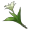               |               [Сесилия](https://raw.githubusercontent.com/AluminiumTN/Sorted-TP-Files-RU/Sorted-TP-Files-RU/Растения/Сиселия.zip)                |     Тейват      |
|                       |        [Сумерская роза](https://raw.githubusercontent.com/AluminiumTN/Sorted-TP-Files-RU/Sorted-TP-Files-RU/Растения/Сумрская%20роза.zip)        |     Тейват      |
|                            |               [Тидалья](https://raw.githubusercontent.com/AluminiumTN/Sorted-TP-Files-RU/Sorted-TP-Files-RU/Растения/Тидалья.zip)                |     Тейват      |
|                           |           [Трава наку](https://raw.githubusercontent.com/AluminiumTN/Sorted-TP-Files-RU/Sorted-TP-Files-RU/Растения/Трава%20Наку.zip)            |     Тейват      |
|               |        [Трава светяшка](https://raw.githubusercontent.com/AluminiumTN/Sorted-TP-Files-RU/Sorted-TP-Files-RU/Растения/Трава-светяшка.zip)         |     Тейват      |
|         | [Туманный цветок](https://raw.githubusercontent.com/AluminiumTN/Sorted-TP-Files-RU/Sorted-TP-Files-RU/Растения/Туманный%20цветок%20(венчик).zip) |     Тейват      |
|                 |       [Фиалковая дыня](https://raw.githubusercontent.com/AluminiumTN/Sorted-TP-Files-RU/Sorted-TP-Files-RU/Растения/Фиалковая%20дыня.zip)        |     Тейват      |
|                       |           [Фрукт хара](https://raw.githubusercontent.com/AluminiumTN/Sorted-TP-Files-RU/Sorted-TP-Files-RU/Растения/Фрукт%20хара.zip)            |     Тейват      |
|                     |       [Цветок сахарок](https://raw.githubusercontent.com/AluminiumTN/Sorted-TP-Files-RU/Sorted-TP-Files-RU/Растения/Цветок%20сахарок.zip)        |     Тейват      |
|              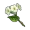               |       [Цветок циньсинь](https://raw.githubusercontent.com/AluminiumTN/Sorted-TP-Files-RU/Sorted-TP-Files-RU/Растения/Цветок%20цинсинь.zip)       |     Тейват      |
|              |         [Цветы скорби](https://raw.githubusercontent.com/AluminiumTN/Sorted-TP-Files-RU/Sorted-TP-Files-RU/Растения/Цветы%20скорби.zip)          |     Тейват      |
|                         |       [Чашечка лотоса](https://raw.githubusercontent.com/AluminiumTN/Sorted-TP-Files-RU/Sorted-TP-Files-RU/Растения/Чашечка%20лотоса.zip)        |     Тейват      |
|           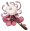            |                  [Шёлк](https://raw.githubusercontent.com/AluminiumTN/Sorted-TP-Files-RU/Sorted-TP-Files-RU/Растения/Шелк.zip)                   |     Тейват      |
|                           |                 [Шишка](https://raw.githubusercontent.com/AluminiumTN/Sorted-TP-Files-RU/Sorted-TP-Files-RU/Растения/Шишка.zip)                  |     Тейват      |
|                                 |                [Яблоко](https://raw.githubusercontent.com/AluminiumTN/Sorted-TP-Files-RU/Sorted-TP-Files-RU/Растения/Яблоко.zip)                 |      Тейват     |
|                                 |                       [Ягода](https://raw.githubusercontent.com/AluminiumTN/Sorted-TP-Files-RU/Sorted-TP-Files-RU/Растения/Ягода.zip)            |     Тейват      |

## ???

|                             Изображения                             |                                                                    Навигация                                                                     | Местонахождение |
|:-------------------------------------------------------------------:|:------------------------------------------------------------------------------------------------------------------------------------------------:|:---------------:|
|                                           |                                                                                                                                              |                 |
|                                           |                                                                                                                                              |                 |
|                                           |                                                                                                                                              |                 |
